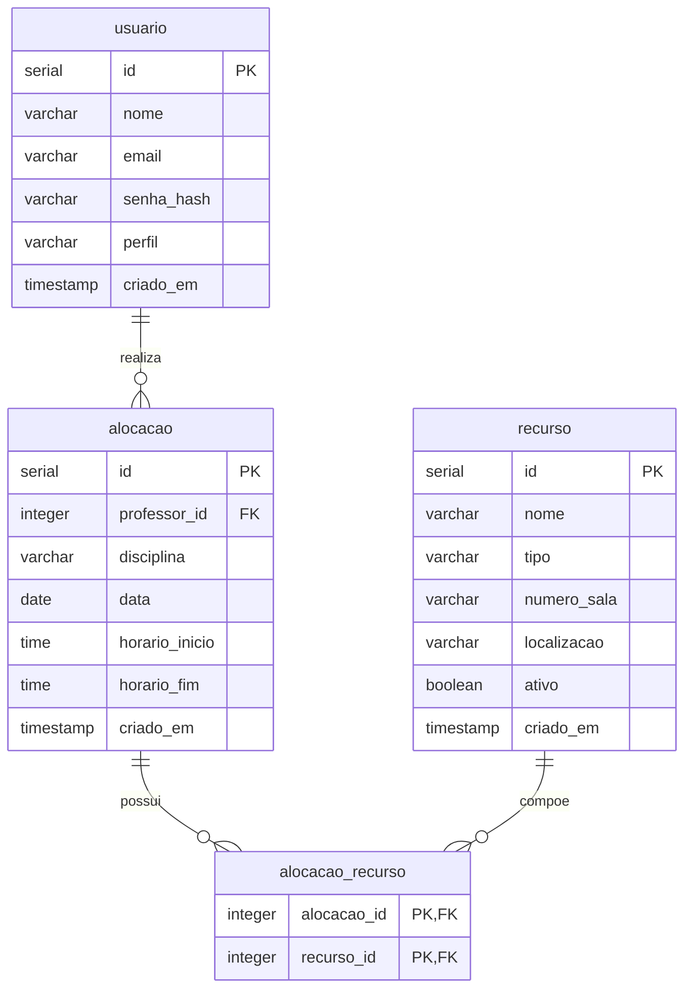

# Diagrama Entidade-Relacionamento

```mermaid
erDiagram
    usuario ||--o{ alocacao : realiza
    alocacao ||--o{ alocacao_recurso : possui
    recurso ||--o{ alocacao_recurso : compoe

    usuario {
        serial id PK
        varchar nome
        varchar email
        varchar senha_hash
        varchar perfil
        timestamp criado_em
    }

    recurso {
        serial id PK
        varchar nome
        varchar tipo
        varchar numero_sala
        varchar localizacao
        boolean ativo
        timestamp criado_em
    }

    alocacao {
        serial id PK
        integer professor_id FK
        varchar disciplina
        date data
        time horario_inicio
        time horario_fim
        timestamp criado_em
    }

    alocacao_recurso {
        integer alocacao_id PK, FK
        integer recurso_id PK, FK
    }
```
